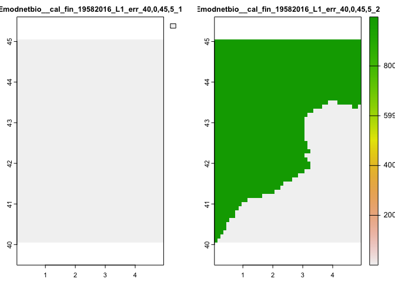

<!-- README.md is generated from README.Rmd. Please edit that file -->

# EMODnetWCS

<!-- badges: start -->

[](https://lifecycle.r-lib.org/articles/stages.html#experimental)
[](https://CRAN.R-project.org/package=EMODnetWCS)
[](https://github.com/EMODnet/EMODnetWCS/actions/workflows/R-CMD-check.yaml)
[](https://app.codecov.io/gh/EMODnet/EMODnetWCS?branch=master)
<!-- badges: end -->

The goal of EMODnetWCS is to allow interrogation of and access to
EMODnet geographic raster data in R though the [EMODnet Web Coverage
Services](https://github.com/EMODnet/Web-Service-Documentation#web-coverage-service-wcs).
See below for available Services. This package was developed by
Sheffield University as part of EMODnet Biology WP4.

[Web Coverage services (WCS)](https://www.ogc.org/standards/wcs) is a
standard created by the OGC that refers to the receiving of geospatial
information as ‘coverages’: digital geospatial information representing
space-varying phenomena. One can think of it as Web Feature Service
(WFS) for raster data. It gets the ‘source code’ of the map, but in this
case it’s not raw vectors but raw imagery.

An important distinction must be made between WCS and Web Map Service
(WMS). They are similar, and can return similar formats, but a WCS is
able to return more information, including valuable metadata and more
formats. It additionally allows more precise queries, potentially
against multi-dimensional backend formats.

## Installation

You can install the development version of EMODnetWCS from GitHub with:

``` r
# install.packages("remotes")
remotes::install_github("EMODnet/EMODnetWCS")
```

Load the library

``` r
library(EMODnetWCS)
#> Loading ISO 19139 XML schemas...
#> Loading ISO 19115 codelists...
```

## Available services

All available services are contained in the tibble returned by
`emdn_wcs()`.

| service_name     | service_url                                                                   |
|:-----------------|:------------------------------------------------------------------------------|
| bathymetry       | <https://ows.emodnet-bathymetry.eu/wcs>                                       |
| biology          | <https://geo.vliz.be/geoserver/Emodnetbio/wcs>                                |
| human_activities | <https://ows.emodnet-humanactivities.eu/wcs>                                  |
| physics          | <https://geoserver.emodnet-physics.eu/geoserver/wcs>                          |
| seabed_habitats  | <https://ows.emodnet-seabedhabitats.eu/geoserver/emodnet_open_maplibrary/wcs> |

To explore available services in Rstudio use:

``` r
View(emdn_wcs())
```

## Create Service Client

Create new WCS Client. Specify the service using the `service` argument.

``` r
wcs <- emdn_init_wcs_client(service = "biology")
#> ✔ WCS client created succesfully
#> ℹ Service: <]8;;https://geo.vliz.be/geoserver/Emodnetbio/wcshttps://geo.vliz.be/geoserver/Emodnetbio/wcs]8;;>
#> ℹ Service: "2.0.1"
```

## Get metadata about a WCS service and available coverages

Get service level and a subset of coverage level metadata, compiled for
easy review by supplying a `WCSClient` object to `emdn_get_wcs_info`.

``` r
emdn_get_wcs_info(wcs)
#> Loading required package: sf
#> Linking to GEOS 3.10.2, GDAL 3.4.2, PROJ 8.2.1; sf_use_s2() is TRUE
#> $data_source
#> [1] "emodnet_wcs"
#> 
#> $service_name
#> [1] "biology"
#> 
#> $service_url
#> [1] "https://geo.vliz.be/geoserver/Emodnetbio/wcs"
#> 
#> $service_title
#> [1] "EMODnet Biology"
#> 
#> $service_abstract
#> [1] "The EMODnet Biology products include a set of gridded map layers showing the average abundance of marine species for different time windows (seasonal, annual) using geospatial modelling. The spatial modelling tool used to calculate the gridded abundance maps is based on DIVA. DIVA (Data-Interpolating Variational Analysis) is a tool to create gridded data sets from discrete point measurements of the ocean. For the representation of time dynamics, it was decided to produce gridded maps for sliding time windows, e.g. combining one or more years  in one gridded map, so that relatively smooth animated GIF presentations can be produced that show the essential change over time. EMODnet Biology’s data products include the Operational Ocean Products and Services (OOPS), harvested by ICES."
#> 
#> $service_access_constraits
#> [1] "NONE"
#> 
#> $service_fees
#> [1] "NONE"
#> 
#> $service_type
#> [1] "urn:ogc:service:wcs"
#> 
#> $coverage_details
#> # A tibble: 10 × 9
#>    coverage_id        dim_n dim_n…¹ extent crs   wgs84…² tempo…³ verti…⁴ subtype
#>    <chr>              <int> <chr>   <chr>  <chr> <chr>   <chr>   <chr>   <chr>  
#>  1 Emodnetbio__ratio…     3 lat(de… -75.0… EPSG… -75.05… 1958-0… NA      Rectif…
#>  2 Emodnetbio__aca_s…     3 lat(de… -75.0… EPSG… -75.05… 1958-0… NA      Rectif…
#>  3 Emodnetbio__cal_f…     3 lat(de… -75.0… EPSG… -75.05… 1958-0… NA      Rectif…
#>  4 Emodnetbio__cal_h…     3 lat(de… -75.0… EPSG… -75.05… 1958-0… NA      Rectif…
#>  5 Emodnetbio__met_l…     3 lat(de… -75.0… EPSG… -75.05… 1958-0… NA      Rectif…
#>  6 Emodnetbio__oit_s…     3 lat(de… -75.0… EPSG… -75.05… 1958-0… NA      Rectif…
#>  7 Emodnetbio__tem_l…     3 lat(de… -75.0… EPSG… -75.05… 1958-0… NA      Rectif…
#>  8 Emodnetbio__chli_…     3 lat(de… -75.0… EPSG… -75.05… 1958-0… NA      Rectif…
#>  9 Emodnetbio__tot_l…     3 lat(de… -75.0… EPSG… -75.05… 1958-0… NA      Rectif…
#> 10 Emodnetbio__tot_s…     3 lat(de… -75.0… EPSG… -75.05… 1958-0… NA      Rectif…
#> # … with abbreviated variable names ¹​dim_names, ²​wgs84_bbox, ³​temporal_extent,
#> #   ⁴​vertical_extent
```

Info can also be extracted using a service name instead of a `WCSClient`
object.

``` r
emdn_get_wcs_info(service = "biology")
#> ✔ WCS client created succesfully
#> ℹ Service: <]8;;https://geo.vliz.be/geoserver/Emodnetbio/wcshttps://geo.vliz.be/geoserver/Emodnetbio/wcs]8;;>
#> ℹ Service: "2.0.1"
#> $data_source
#> [1] "emodnet_wcs"
#> 
#> $service_name
#> [1] "biology"
#> 
#> $service_url
#> [1] "https://geo.vliz.be/geoserver/Emodnetbio/wcs"
#> 
#> $service_title
#> [1] "EMODnet Biology"
#> 
#> $service_abstract
#> [1] "The EMODnet Biology products include a set of gridded map layers showing the average abundance of marine species for different time windows (seasonal, annual) using geospatial modelling. The spatial modelling tool used to calculate the gridded abundance maps is based on DIVA. DIVA (Data-Interpolating Variational Analysis) is a tool to create gridded data sets from discrete point measurements of the ocean. For the representation of time dynamics, it was decided to produce gridded maps for sliding time windows, e.g. combining one or more years  in one gridded map, so that relatively smooth animated GIF presentations can be produced that show the essential change over time. EMODnet Biology’s data products include the Operational Ocean Products and Services (OOPS), harvested by ICES."
#> 
#> $service_access_constraits
#> [1] "NONE"
#> 
#> $service_fees
#> [1] "NONE"
#> 
#> $service_type
#> [1] "urn:ogc:service:wcs"
#> 
#> $coverage_details
#> # A tibble: 10 × 9
#>    coverage_id        dim_n dim_n…¹ extent crs   wgs84…² tempo…³ verti…⁴ subtype
#>    <chr>              <int> <chr>   <chr>  <chr> <chr>   <chr>   <chr>   <chr>  
#>  1 Emodnetbio__ratio…     3 lat(de… -75.0… EPSG… -75.05… 1958-0… NA      Rectif…
#>  2 Emodnetbio__aca_s…     3 lat(de… -75.0… EPSG… -75.05… 1958-0… NA      Rectif…
#>  3 Emodnetbio__cal_f…     3 lat(de… -75.0… EPSG… -75.05… 1958-0… NA      Rectif…
#>  4 Emodnetbio__cal_h…     3 lat(de… -75.0… EPSG… -75.05… 1958-0… NA      Rectif…
#>  5 Emodnetbio__met_l…     3 lat(de… -75.0… EPSG… -75.05… 1958-0… NA      Rectif…
#>  6 Emodnetbio__oit_s…     3 lat(de… -75.0… EPSG… -75.05… 1958-0… NA      Rectif…
#>  7 Emodnetbio__tem_l…     3 lat(de… -75.0… EPSG… -75.05… 1958-0… NA      Rectif…
#>  8 Emodnetbio__chli_…     3 lat(de… -75.0… EPSG… -75.05… 1958-0… NA      Rectif…
#>  9 Emodnetbio__tot_l…     3 lat(de… -75.0… EPSG… -75.05… 1958-0… NA      Rectif…
#> 10 Emodnetbio__tot_s…     3 lat(de… -75.0… EPSG… -75.05… 1958-0… NA      Rectif…
#> # … with abbreviated variable names ¹​dim_names, ²​wgs84_bbox, ³​temporal_extent,
#> #   ⁴​vertical_extent
```

Get more detailed coverage metadata about specific coverage.

``` r
emdn_get_coverage_info(wcs, 
                       coverage_ids = "Emodnetbio__cal_fin_19582016_L1_err")
#> # A tibble: 1 × 21
#>   data_s…¹ servi…² servi…³ cover…⁴ band_…⁵ band_…⁶ const…⁷ nil_v…⁸ dim_n dim_n…⁹
#>   <chr>    <chr>   <chr>   <chr>   <chr>   <chr>   <chr>     <dbl> <int> <chr>  
#> 1 emodnet… https:… biology Emodne… Relati… W.m-2.… -3.402… 9.97e36     3 lat(de…
#> # … with 11 more variables: grid_size <chr>, resolution <chr>, extent <chr>,
#> #   crs <chr>, wgs84_extent <chr>, temporal_extent <chr>,
#> #   vertical_extent <chr>, subtype <chr>, fn_seq_rule <chr>,
#> #   fn_start_point <chr>, fn_axis_order <chr>, and abbreviated variable names
#> #   ¹​data_source, ²​service_name, ³​service_url, ⁴​coverage_id, ⁵​band_description,
#> #   ⁶​band_uom, ⁷​constraint, ⁸​nil_value, ⁹​dim_names
```

> **Note**
>
> To minimize the number of requests sent to webservices, these
> functions use [`memoise`](https://memoise.r-lib.org/) to cache results
> inside the active R session. To clear the cache, re-start R or run
> `memoise::forget(emdn_get_wcs_info)`/`memoise::forget(emdn_get_coverage_info)`

The package also offers a number of functions for extracting individual
metadata in more usable forms. e.g.

``` r
emdn_get_coverage_ids(wcs)
#>  [1] "Emodnetbio__ratio_large_to_small_19582016_L1_err"
#>  [2] "Emodnetbio__aca_spp_19582016_L1"                 
#>  [3] "Emodnetbio__cal_fin_19582016_L1_err"             
#>  [4] "Emodnetbio__cal_hel_19582016_L1_err"             
#>  [5] "Emodnetbio__met_luc_19582016_L1_err"             
#>  [6] "Emodnetbio__oit_spp_19582016_L1_err"             
#>  [7] "Emodnetbio__tem_lon_19582016_L1_err"             
#>  [8] "Emodnetbio__chli_19582016_L1_err"                
#>  [9] "Emodnetbio__tot_lar_19582016_L1_err"             
#> [10] "Emodnetbio__tot_sma_19582016_L1_err"
```

For more details, please refer to the [Getting metadata about Services &
Coverages](https://emodnet.github.io/EMODnetWCS/articles/metadata.html)
article in the `EMODnetWCS` online documentation.

## Downloading Coverages

The package also provides a function to download full or subsets of
coverages from EMODnetWCS services.

The following example downloads a spatial subset of a coverage using a
bounding box.

``` r
cov <- emdn_get_coverage(wcs, 
                  coverage_id = "Emodnetbio__cal_fin_19582016_L1_err",
                  bbox = c(xmin = 0, 
                           ymin = 40, 
                           xmax = 5, 
                           ymax = 45),
                  nil_values_as_na = TRUE
                  )
#> ── Downloading coverage "Emodnetbio__cal_fin_19582016_L1_err" ──────────────────
#> <GMLEnvelope>
#> ....|-- lowerCorner: 40 0 "1958-02-16T00:00:00"
#> ....|-- upperCorner: 45 5 "2016-11-16T00:00:00"
#> 
#> ✔ Coverage "Emodnetbio__cal_fin_19582016_L1_err" downloaded succesfully as a
#> terra <SpatRaster>
#> ✔ nil values 9.96920996838687e+36 converted to NA on all bands.

cov
#> class       : SpatRaster 
#> dimensions  : 50, 49, 2  (nrow, ncol, nlyr)
#> resolution  : 0.1, 0.1  (x, y)
#> extent      : 0.05, 4.95, 40.05, 45.05  (xmin, xmax, ymin, ymax)
#> coord. ref. : lon/lat WGS 84 (EPSG:4326) 
#> source      : memory 
#> names       : Emodnetbio__cal~_00_40,0,45,5_1, Emodnetbio__cal~_00_40,0,45,5_2 
#> min values  :                             NaN,                       0.9999981 
#> max values  :                             NaN,                       0.9999999
```

``` r
terra::plot(cov)
```



For more details on downloading coverages, please refer to the [Download
Coverages](https://emodnet.github.io/EMODnetWCS/articles/coverages.html)
article in the `EMODnetWCS` online documentation.

## Citation

To cite EMODnetWCS, please use the output from
`citation(package = "EMODnetWCS")`.

``` r
citation(package = "EMODnetWCS")
#> 
#> To cite package 'EMODnetWCS' in publications use:
#> 
#>   Krystalli A (2022). _EMODnetWCS: Access EMODnet Web Coverage Service
#>   data through R_. R package version 0.0.0.9012. Integrated data
#>   products created under the European Marine Observation Data Network
#>   (EMODnet) Biology project (EASME/EMFF/2017/1.3.1.2/02/SI2.789013),
#>   funded by the European Union under Regulation (EU) No 508/2014 of the
#>   European Parliament and of the Council of 15 May 2014 on the European
#>   Maritime and Fisheries Fund, <https://github.com/EMODnet/EMODnetWCS>.
#> 
#> A BibTeX entry for LaTeX users is
#> 
#>   @Manual{,
#>     title = {{EMODnetWCS}: Access EMODnet Web Coverage Service data through R},
#>     author = {Anna Krystalli},
#>     year = {2022},
#>     note = {R package version 0.0.0.9012. Integrated data products created under the European Marine Observation Data Network (EMODnet) Biology project (EASME/EMFF/2017/1.3.1.2/02/SI2.789013), funded by the European Union under Regulation (EU) No 508/2014 of the European Parliament and of the Council of 15 May 2014 on the European Maritime and Fisheries Fund},
#>     url = {https://github.com/EMODnet/EMODnetWCS},
#>   }
```

## Code of Conduct

Please note that the EMODnetWCS project is released with a [Contributor
Code of
Conduct](https://emodnet.github.io/EMODnetWCS/CODE_OF_CONDUCT.html). By
contributing to this project, you agree to abide by its terms.
